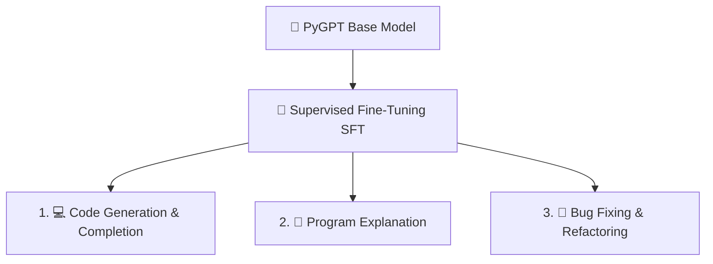

# 🎯 Step 06: PyGPT Instruction-Tuning & Code Generation Guide

This guide documents the **Instruction-Tuning (Supervised Fine-Tuning - SFT)** pipeline and **Inference Engine** for teaching PyGPT to follow coding instructions, explain Python programs, and propose bug fixes.

---

## 🎯 3 Core Instruction Tasks



### 1. Code Generation & Instruction Following
- **Instruction**: *"Write a Python function to compute the factorial of a given non-negative integer using recursion."*
- **Response**:
  ```python
  def factorial(n: int) -> int:
      if n <= 1:
          return 1
      return n * factorial(n - 1)
  ```

### 2. Program Explanation
- **Instruction**: *"Explain what the following Python program does:"*
- **Input Code**: `s[::-1]`
- **Response**: *"This function returns a reversed string by utilizing Python's extended slicing notation `[::-1]` with step `-1`."*

### 3. Bug Fixing & Refactoring
- **Instruction**: *"Identify and fix the IndexError bug in the following list search function:"*
- **Input Code**: `return lst[len(lst)]`
- **Response**:
  ```python
  def get_last_item(lst):
      if not lst:
          return None
      return lst[-1]
  ```

---

## 🛠️ Instruction Fine-Tuning CLI ([`finetune_pygpt.py`](finetune_pygpt.py))

To run instruction fine-tuning on your pre-trained model:

```bash
python3 finetune_pygpt.py
```

- **Base Checkpoint**: Loads [`checkpoints/best_model.pt`](checkpoints/best_model.pt)
- **Fine-Tuning LR**: $2\times 10^{-5}$
- **Instruction Model Output**: Saved to [`checkpoints/instruction_model.pt`](checkpoints/instruction_model.pt)

---

## 💻 Running Code Generation & Inference

### 1. CLI Code Generator ([`generate.py`](generate.py)):

#### Code Completion:
```bash
python3 generate.py --prompt "def fibonacci(n: int) -> int:"
```

#### Instruction Following:
```bash
python3 generate.py \
    --instruction "Write a FastAPI GET health endpoint" \
    --task generate
```

#### Program Explanation:
```bash
python3 generate.py \
    --instruction "Explain this function" \
    --code "def add(a, b): return a + b" \
    --task explain
```

#### Bug Fixing:
```bash
python3 generate.py \
    --instruction "Fix ZeroDivisionError" \
    --code "def avg(l): return sum(l)/len(l)" \
    --task fix_bug
```

#### Interactive Chat Mode:
```bash
python3 generate.py --interactive
```

---

## 📡 API Endpoints ([`main.py`](main.py))

- `POST /model/generate`: Raw code generation & completion.
- `POST /model/instruction`: Instruction following, program explanation, and bug fixing.

```bash
curl -X POST http://localhost:8000/model/instruction \
  -H "Content-Type: application/json" \
  -d '{
    "instruction": "Write a recursive factorial function",
    "task_type": "generate",
    "max_new_tokens": 150
  }'
```
