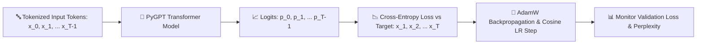

# 🚀 Step 05: PyGPT Model Pre-training Guide

This guide documents the next-token prediction pre-training loop, validation loss monitoring, learning rate schedules, and model checkpointing for the **PyGPT Transformer**.

---

## 📐 Pre-training Architecture & Next-Token Prediction



### Mathematical Objective:
PyGPT is trained using autoregressive causal language modeling (Next-Token Prediction). Given a sequence of tokens $X = (x_1, x_2, \dots, x_T)$, the training loss is the negative log-likelihood of predicting each token given its preceding context:

$$\mathcal{L}_{\text{pretrain}}(\Theta) = -\frac{1}{T} \sum_{t=1}^T \log P_{\Theta}(x_t \mid x_1, x_2, \dots, x_{t-1})$$

---

## ⚙️ Trainer Components ([`app/training/trainer.py`](app/training/trainer.py))

| Component | Implementation | Description |
| :--- | :--- | :--- |
| **Loss Function** | `torch.nn.functional.cross_entropy` | Categorical Cross-Entropy over 32,000 vocabulary logits |
| **Optimizer** | `torch.optim.AdamW` | $\beta_1=0.9, \beta_2=0.95$, learning rate $1\times 10^{-4}$, weight decay $0.01$ |
| **LR Scheduler** | `torch.optim.lr_scheduler.CosineAnnealingLR` | Smooth cosine decay down to $\eta_{\text{min}} = 1\times 10^{-5}$ |
| **Gradient Clipping** | `torch.nn.utils.clip_grad_norm_` | Max gradient norm $= 1.0$ to ensure numerical stability |
| **Validation Metric** | Validation Loss & Perplexity ($\text{PPL} = \exp(\text{Val Loss})$) | Evaluates out-of-sample generalization after fixed step intervals |
| **Checkpointing** | `checkpoints/best_model.pt` | Automatically saves model weights whenever validation loss reaches a new minimum |

---

## 💻 How to Launch Pre-training

### Basic Pre-training Command:
```bash
python3 train_pygpt.py
```

### Custom Options & Multi-GPU / Fast Training:
```bash
python3 train_pygpt.py \
    --train_file data/processed/train_tokens.json \
    --val_file data/processed/val_tokens.json \
    --epochs 3 \
    --batch_size 8 \
    --seq_len 512 \
    --lr 0.0001 \
    --eval_interval 50
```

---

## 📊 Expected Terminal Output

```text
🧠 PyGPT Pre-training Initialization
   Train File: /path/to/pygpt-model/data/processed/train_tokens.json
   Val File:   /path/to/pygpt-model/data/processed/val_tokens.json
   Epochs: 3 | Batch Size: 4 | Seq Len: 512 | LR: 0.0001
🖥️ Initializing PyGPT Trainer on Device: cuda

🚀 Starting PyGPT Pre-training...
📖 Loading token dataset from: train_tokens.json...
✅ Loaded 14,367,200 tokens -> 28,060 samples (seq_len=512)
📖 Loading token dataset from: val_tokens.json...
✅ Loaded 756,168 tokens -> 1,476 samples (seq_len=512)

Epoch [1/3] | Step [50/7015] | Train Loss: 4.8210 | Val Loss: 4.1205 | Val PPL: 61.59 | LR: 0.000099
🌟 Best model checkpoint saved to: checkpoints/best_model.pt (Val Loss: 4.1205)
Epoch [1/3] | Step [100/7015] | Train Loss: 3.9850 | Val Loss: 3.4120 | Val PPL: 30.33 | LR: 0.000097
🌟 Best model checkpoint saved to: checkpoints/best_model.pt (Val Loss: 3.4120)

🎉 PyGPT Pre-training Finished!
   Best Validation Loss: 3.4120
   Checkpoint Location: checkpoints/best_model.pt
```
